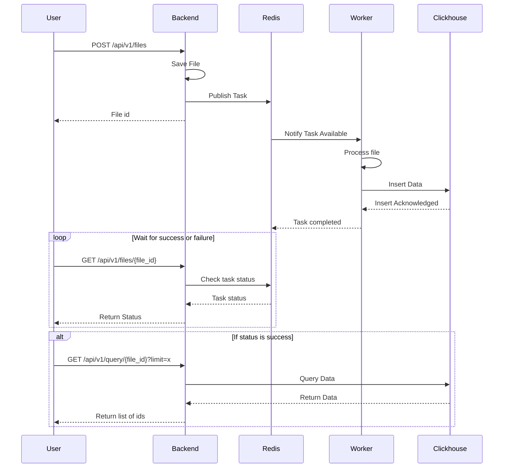

## Project

This is a case-study for Ampliforce in the context of the recruiting process.

## How to run the project

#### 1. Clone this repo
```shell
git clone git@github.com:Math-007/ampliforce-case-study.git
cd ampliforce-case-study
```

#### 2. Start necessary components using docker
```shell
docker compose up
```

This command will start the following components:
1. FastAPI backend
2. Celery worker
3. Redis broker
4. Clickhouse database

#### 3. Run the end-to-end tests
```shell
python3 -m venv .venv
source .venv/bin/activate
pip install -r equirements-tests.txt
pytest tests/end2end  --durations=0 -v
```

### Architecture

The following diagram illustrates the architecture.



### Performance Analysis

The performance of this application can be analyzed in two aspects:
1. **Indexing Process**
2. **Querying Process**

#### Indexing Process:
The indexing process has a **time complexity of O(n)** since we need to process each line of the file individually and insert it into the database.

In terms of **memory complexity**, it is **O(1) per chunk** due to the chunking strategy, which prevents the entire file from being loaded into memory at once.

In terms of **disk space complexity**, it is **O(n)** since every record is inserted into the database.

#### Querying Process:
The table is structured as follows:
```sql
create table file_data
(
    id       UUID,
    value_id Int32,
    value    Int32,
    file_id  String
)
    engine = MergeTree ORDER BY (file_id, value DESC)
        SETTINGS allow_experimental_reverse_key = true, index_granularity = 8192;
```
The query executed is:
```sql
SELECT *
FROM file_data
WHERE file_id = '<file-id>'
ORDER BY value DESC
LIMIT <limit>;
```
* **Filtering (WHERE condition)**: Secondary MergeTree index is available, the complexity is O(log N).
* **Ordering (ORDER BY value DESC)**: Value is indexed for efficient sorting, does not require additional sorting. The complexity is O(1).
* **LIMIT operation**: ClickHouse takes advantage of the sorted structure, retrieving the top 5 results is O(1)

In summary, the indexing process is linear in time and constant in memory (per chunk), while the querying process benefits from ClickHouse’s indexing.

### Resources

* https://fastapi.tiangolo.com/
* https://docs.sqlalchemy.org/en/20/index.html
* https://docs.celeryq.dev/en/stable/getting-started/first-steps-with-celery.html
* https://clickhouse.com/docs/en/engines/table-engines/mergetree-family/mergetree
* https://clickhouse-sqlalchemy.readthedocs.io/en/latest/features.html#dialect-specific-options
* https://clickhouse.com/docs/en/operations/settings/merge-tree-settings#allow_experimental_reverse_key
